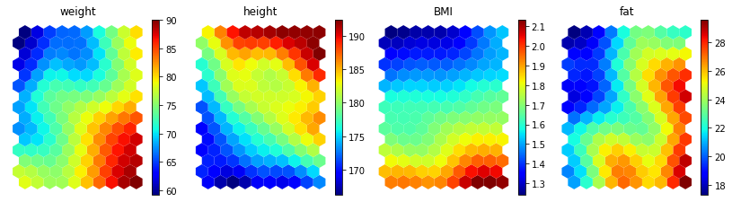
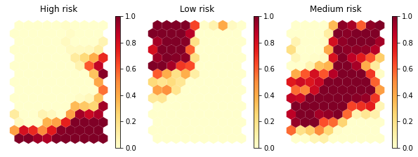

# _Somnium_: Self-Organising Maps for humans.

> *Explore your data while it sleeps.*

<p align="center">
  
</p>

<p align="center">
  
</p>


## What is it?
Somnium is a Python library for exploring multi-dimensional datasets using the Self-Organising Map algorithm (aka Kohonen map).

A _Self-Organising Map_ (_SOM_) is a biologically inspired algorithm that compresses high-dimensional data into geometric relationships on a low-dimensional grid. Each neuron on the grid learns to represent a region of the input space, and nearby neurons represent similar data. The result is a topographic map where you can visually explore patterns, clusters, and relationships in your data.

## Main applications
- Discover non-linear relations between variables at a glance.
- Micro-segment instances in a visually understandable way.
- Work as a surrogate model of a black-box model for explainability.
- Feature selection/reduction by finding correlated variables.
- Anomaly detection via high quantization error.

## Installation

Install directly into an existing project:

```bash
pip install git+https://github.com/ivallesp/somnium.git
```

Or with uv:

```bash
uv add git+https://github.com/ivallesp/somnium.git
```

For development (clone and install in editable mode):

```bash
git clone https://github.com/ivallesp/somnium
cd somnium
uv sync
```

## Quick start

```python
from somnium.core import SOM

model = SOM(
    mapsize="auto",              # or (15, 10); auto estimates from data
    lattice="hexa",              # "hexa", "rect", "toroidal_hexa", "toroidal_rect",
                                 # "cylindrical_hexa", "cylindrical_rect"
    neighborhood="gaussian",     # "gaussian", "bubble", "cut_gaussian", "mexican_hat",
                                 # "epanechicov"
    normalization="standard",    # "standard", "minmax", "log", "logistic", "boxcox"
    initialization="pca",        # "pca" or "random"
    distance_metric="euclidean", # any scipy distance metric
    n_jobs=1,                    # -1 for all cores
)

model.fit_auto(data)

# For more control, use fit() directly with two phases:
# model.fit(data, epochs=30, radiusin=20, radiusfin=5, decay="linear")
# model.fit(data, epochs=30, radiusin=5,  radiusfin=1, decay="exponential")

# Metrics (lower is better for all)
print(f"Quantization error: {model.calculate_quantization_error():.4f}")  # per-feature MAE
print(f"Topographic error:  {model.calculate_topographic_error():.4f}")   # fraction with non-adjacent BMUs
print(f"Vacancy rate:       {model.calculate_vacancy_rate():.4f}")        # fraction of unused neurons

# Predict BMUs for new data
bmus = model.predict(new_data)
```

## Training modes

### Batch training (default)
Updates the codebook using all data points at once each epoch. Fast, deterministic, and parallelizable.

```python
model.fit(
    data,
    epochs=30, radiusin=20, radiusfin=5,
    decay="linear",            # "linear" or "exponential"
    learning_rate=1.0,         # <1.0 blends old and new codebook for smoother updates
    subsample_ratio=1.0,       # <1.0 for stochastic subsampling each epoch
    collect_history=True,      # track QE, TE, VR per epoch
)
```

### Online (sequential) training
The classic Kohonen algorithm: updates the codebook after each sample. Slower but can escape local minima.

```python
model.fit_online(
    data,
    epochs=30, radiusin=20, radiusfin=5,
    learning_rate_init=0.1, learning_rate_fin=0.01,
    decay="linear",
    collect_history=True,
)
```

### Training convergence
When `collect_history=True`, per-epoch metrics are stored in `model.history_`:

```python
model.history_["quantization_error"]   # list of floats
model.history_["topographic_error"]    # list of floats
model.history_["vacancy_rate"]         # list of floats
```

## Visualization

```python
from somnium.visualization import (
    plot_components,       # one heatmap per feature
    plot_umatrix,          # inter-neuron distances (cluster boundaries)
    plot_bmus,             # hit map (data density)
    plot_quality_map,      # per-neuron quantization error
    plot_label_map,        # per-class proportion heatmaps
    plot_neuron_indices,   # grid with neuron index numbers
)
```

### Component planes
One heatmap per input feature. Correlated features produce similar-looking planes.


### Label map
Given class labels (not used during training), shows per-class proportion heatmaps — one subplot per label.


### Other visualizations
- **U-Matrix**: distances between neighboring neurons. Bright ridges = cluster boundaries, dark valleys = cluster cores.
- **Hit map**: size of each cell proportional to how many data points map to it. Empty cells = dead neurons.
- **Quality map**: per-neuron quantization error heatmap. Red = high error, green = low.
- **Neuron index map**: grid with neuron indices labeled, for cross-referencing with `predict()` output.

## Save and load

```python
model.save("my_som.pkl")
loaded = SOM.load("my_som.pkl")
```

## Features
- **Lattices**: hexagonal, rectangular — flat, toroidal (both axes wrap), or cylindrical (columns wrap)
- **Neighborhoods**: Gaussian, bubble, cut Gaussian, Mexican hat, Epanechicov
- **Normalization**: standard, min-max, log, logistic, Box-Cox
- **Initialization**: random, PCA
- **Training**: batch and online modes; multi-phase with linear or exponential radius decay; `fit_auto()` convenience method; per-epoch convergence tracking
- **Map size**: manual or auto-estimated from data (5*sqrt(N) heuristic with PCA aspect ratio)
- **Metrics**: quantization error (MAE), topographic error, vacancy rate
- **Visualization**: component planes, U-matrix, BMU hit maps, quality map, label map, neuron index map
- **Persistence**: save/load trained models via pickle

## Examples

See `examples/getting_started.ipynb` for a complete walkthrough of every feature.

Additional examples on real datasets:
- `examples/toy/` — synthetic correlated data
- `examples/spotify/` — Spotify audio features (114k tracks)
- `examples/happiness/` — World Happiness Report (2015-2022)
- `examples/creditcard/` — credit card fraud detection

## Tests

```bash
uv run python -m pytest somnium/tests/ -v
```

## Attribution
This library was built using [SOMPY](https://github.com/sevamoo/SOMPY) as a starting point.

## References

- Kohonen, T. (1982). *Self-organized formation of topologically correct feature maps*. Biological Cybernetics, 43(1), 59-69.
- Kohonen, T. (2001). *Self-Organizing Maps*. Springer, 3rd edition.
- Vesanto, J. & Alhoniemi, E. (2000). *Clustering of the Self-Organizing Map*. IEEE Transactions on Neural Networks, 11(3), 586-600.
- Kiviluoto, K. (1996). *Topology preservation in self-organizing maps*. Proceedings of ICNN'96, 294-299.
- Venna, J. & Kaski, S. (2006). *Local multidimensional scaling*. Neural Networks, 19(6-7), 889-899.
- Ultsch, A. & Siemon, H.P. (1990). *Kohonen's Self Organizing Feature Maps for Exploratory Data Analysis*. Proceedings of INNC'90.
- Bauer, H.U. & Pawelzik, K.R. (1992). *Quantifying the neighborhood preservation of self-organizing feature maps*. IEEE Transactions on Neural Networks, 3(4), 570-579.

## License
MIT. Do whatever you want with it. Fork it, break it, ship it, sell it, print it and frame it. No permission needed, no strings attached. See `LICENSE`. Copyleft (c) 2019-2026 Iván Vallés Pérez
